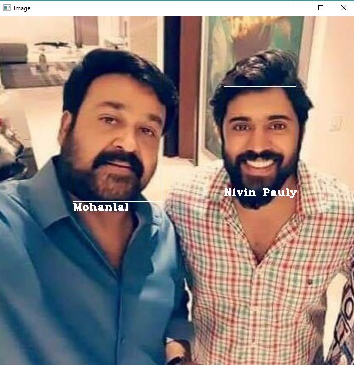
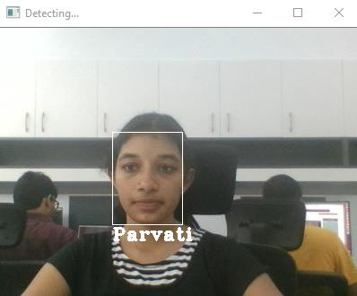
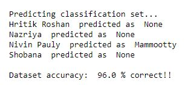

# Face Recognition using FaceNet in PyTorch

Face recognition is the ability to look at the digital image of a human and recognize the person just by looking at the face.

FaceNet was introduced in 2015 by Google researchers; it has been a backbone of many open source Face Recognition networks like OpenFace.
It is a one shot learning method that uses a Deep Convolutional Network to directly optimize the embeddings.
The network consists of a batch input layer and a deep CNN followed by L2 normalization, which results in the face embedding. 
This is followed by the triplet loss during training.

It returns a 512 dimensional vector face embeddings for each face. 

## Description

A facial recognition system is a technology capable of identifying or verifying a person from a digital image or a video frame from a video source. There are multiples methods in which facial recognition systems work, but in general, they work by comparing selected facial features from given image with faces within a dataset. 

This FaceNet model uses Inception Resnet (V1) architecture (GoogLeNet) , and is pretrained on VGGFace2 dataset.

Here, we have used MTCNN to detect and align faces.
Haarcascade classifier is used to detect faces from webcam, since it is faster. For real time general purposes, the model should work fast enough.

## Method Implemented

The model runs on CPU. 
It is coded in Jupyter notebook.

So let's take a brief look on each step

### Step 1: Hit the following commands in CMD/Terminal if you don't have already them installed:

#### Install PyTorch (without CUDA) using
conda install pytorch-cpu -c pytorch 

pip3 install torchvision

#### Install OpenCV
pip install opencv-python

### Step 2: Face Recognition from Image

Dataset used: 'Film' it has images of over 10 celebrities.
Run 'FaceRecognition_Image.ipynb'

First get the embeddings by running the first code cell.
Then in the next code cell, specify the image location and run the code.

Result is as follows:

### Step 3: Face Recognition from webcam

Dataset used: 'Personal' (You can make this dataset just like 'Film' by adding images of each person in their respective folders)
Run 'FaceRecognition_Webcam.ipynb'

First get the embeddings by running the first code cell.
Run the next code cell, after specifying the locations properly.

Result is as follows:

### Step 4: Accuracy of 'Film' dataset

Dataset used: 'Film'
Testing set has two images of each 10 celebreties.
Prediction set has 100 images (10 of each celebrity)

First get the embeddings by running the first code cell.
Then in the next code cell, specify the Prediction set location and run the code.

Result is as follows:

## Conclusion

The model runs perfectly on CPU. Since the model is pretraied, GPU is not required. 
For images through webcam, Haarcascade classifier is preffered over MTCNN, as it is comparitevely faster.

Dataset 'Film' has 96% accuracy on the prediction set.

## References

timesler's implementation of facenet model in pytorch: https://github.com/timesler/facenet-pytorch

Deep Face Recognition: A Survey https://arxiv.org/pdf/1804.06655.pdf

Real time face recognition using opencv and Deep learning,by Atul Kumar https://www.youtube.com/watch?v=-HweZMO5sFY

FaceNet: A Unified Embedding for Face Recognition and Clustering, https://arxiv.org/pdf/1503.03832.pdf

Data set: Collected from Google images and instagram accounts
          

